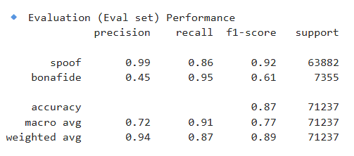
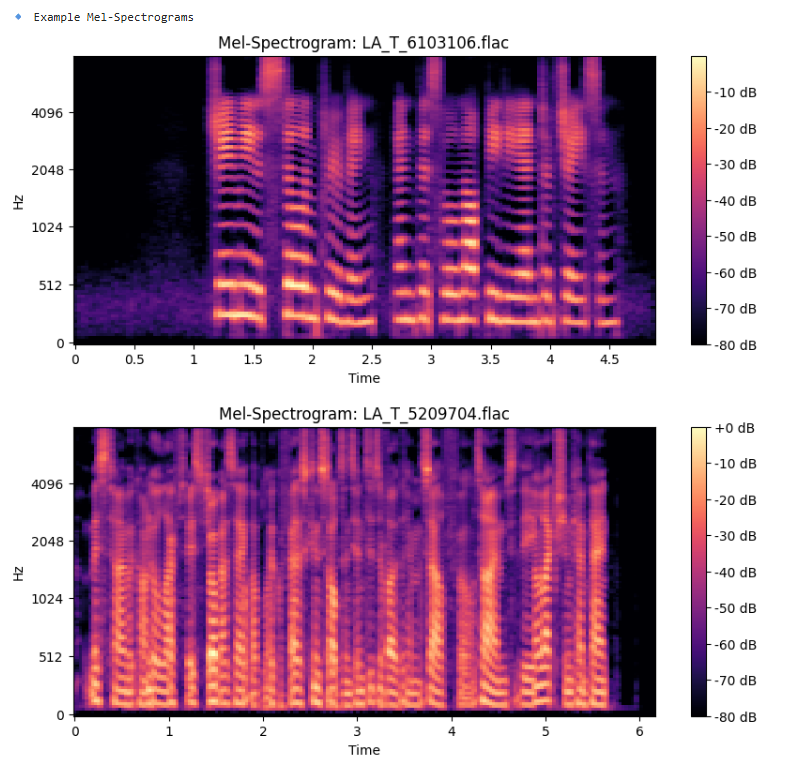

# Deepfake Audio Detection using Lightweight CNN

## Overview

This project implements a **Deepfake Audio Detection system** using a **Lightweight Convolutional Neural Network (CNN)**.
The model analyzes audio features extracted from speech signals and predicts whether the input audio is **real or AI-generated (deepfake)**.

The goal of this project is to demonstrate how deep learning can be used to detect synthetic or manipulated audio.

---

## Features

* Audio preprocessing and feature extraction
* Mel Spectrogram generation from audio signals
* Lightweight CNN model for classification
* Deepfake vs Real audio prediction
* Jupyter Notebook implementation

---

## Technologies Used

* Python
* TensorFlow / Keras
* Librosa
* NumPy
* Matplotlib
* Jupyter Notebook

---

## Dataset

The dataset used for training and testing the model can be accessed from the link below:

Deepfake Audio Dataset:
[https://www.kaggle.com/datasets](https://www.kaggle.com/datasets/awsaf49/asvpoof-2019-dataset)

*(Note: Due to large file size, the dataset is not included in this repository. Please download it from the link above and place it in the `dataset/` folder.)*

---

## Project Structure

deepfake-audio-detection-cnn
│
├── Deepfake_Audio_Detection_CNN.ipynb
├── requirements.txt
├── README.md
├── dataset/
│   └── README.txt
└── images/
├── training_accuracy.png
├── spectrogram.png
└── prediction_output.png

---

## Installation

Clone the repository:

```
git clone https://github.com/Akashkarale778/deepfake-audio-detection-cnn
```

Navigate to the project folder:

```
cd deepfake-audio-detection-cnn
```

Install required dependencies:

```
pip install -r requirements.txt
```

---

## Usage

1. Download the dataset from the provided link.
2. Place the dataset inside the `dataset/` folder.
3. Open the Jupyter Notebook:

```
Deepfake_Audio_Detection_CNN.ipynb
```

4. Run all cells to train the model and test predictions.

---

## Model Training



---

## Audio Feature Extraction

Mel Spectrogram visualization used as input for the CNN model.




---

## Future Improvements

* Real-time audio deepfake detection
* Web interface for uploading audio samples
* Model optimization for faster inference
* Support for multiple deepfake generation techniques
